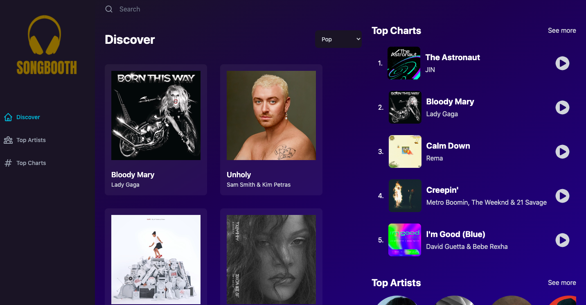
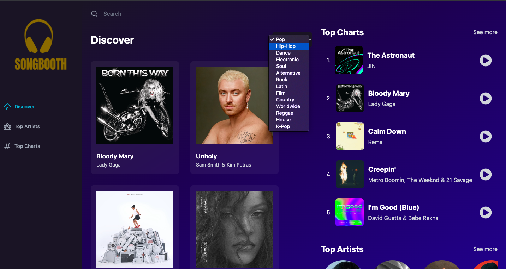
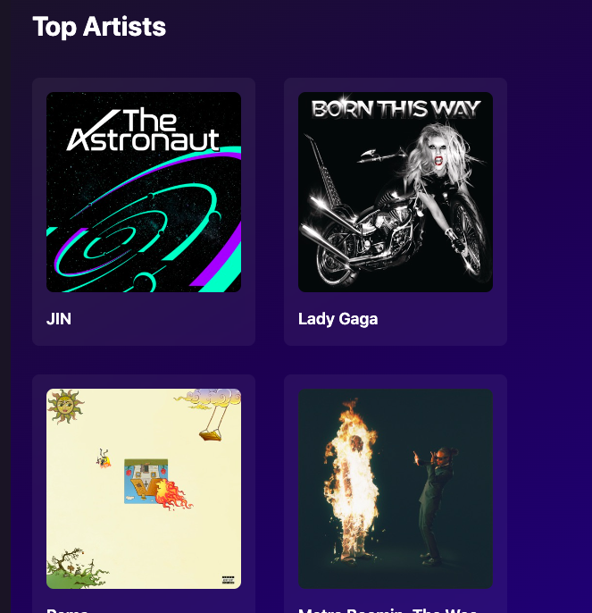
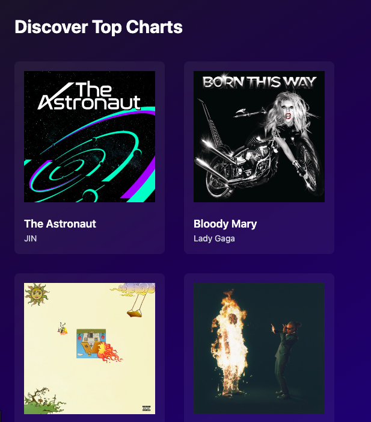
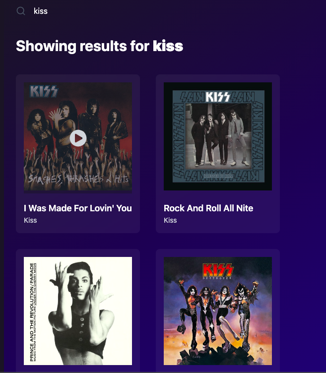

# README

# SongBooth

SongBooth is a music hub inspired by Spotify. The primary use is for users to 
discover new songs/artists, and sample them out before purchasing them. Each song contains lyrics to follow along with, and related songs that users may like as well. Songs can be discovered via genre selection, top charts, or search.

### [Demo](https://songbooth.netlify.app/)

## Technological Skills used 

* React

* Redux

* JavaScript

* Tailwind

* RapidAPI

## Features

* Genre Selection

* Top Artists

* Top Charts

* Search

## To Run Locally

* In your terminal, run npm run dev
